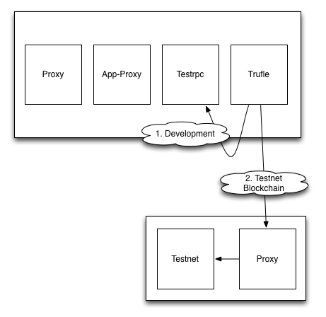

# Upchain Hackathon Starter Pack

This repository gives you a fast start into the World of developing for the  [Blockchain](https://en.wikipedia.org/wiki/Block_chain),  write smart [contracts](https://en.wikipedia.org/wiki/Smart_contract) in Solidity and provide [Dapps](http://dapps.ethercasts.com/) to access them.

## 2 Modes

There are 2 basic things you can do with this setup



1. Develop and Test Smart contract code locally
2. Deploy the code to testnet and test your allication with a public blockchain


## Current shortcomings (hackathon perspective)

Is this true?
* Https certificates need to be installed
* Applications always require a password
* Difficult debugging on testnet as errors end up in proxy and are not relayed to the user

## Features

* Test Driven Development for Smart Contracts
* HTTPS first - Adds HTTPS to your development setup
* Test your contracts locally and a global test block chain
* Create a basic decentralized application

## Ingredients

* [upchain-ethereum-rpc-proxy](https://github.com/Upchain/upchain-ethereum-rpc-proxy)
* [upchain-web3-http-provider](https://github.com/Upchain/web3-http-provider)
* [ethereumjs-testrpc](https://github.com/ethereumjs/testrpc)
* [truffle](https://github.com/ConsenSys/truffle/)
* [geth](https://github.com/ethereum/go-ethereum/wiki/geth) -> Is geth really an ingredient for the hackathon package? Do users need to run it -> it's on our server, people simply connect to it, no?
 


## Getting started

Getting started with development

* Clone this repo
* Install dependencies
* Start your dapp
  1. Starts testrpc
  2. Starts the  proxy
  3. Starts truffle and builds contracts
  4. Starts the proxy for the truffle app

Deploy your contracts

1. Deploys to testrpc first
2. Runs all tests
3. If OK: Deploy to testned
4. Return contracts addresses

```bash
npm run contracts:deploy:testnet
#does: upchain deploy --testnet --apiKey <YourApiKey>
```
## Prerequisites

* Node.js 6.0+
* Command Line Tools
  * Mac OS X: Xcode (or OS X 10.9+: xcode-select --install)
  * Ubuntu /  Linux Mint: sudo apt-get install build-essential
  * Fedora: sudo dnf groupinstall "Development Tools"
  * OpenSUSE: sudo zypper install --type pattern devel_basis

## Documentation

* [Architectural Overview](./docs/overview.md)
  * [Proxy](./docs/architecture-proxy.md) - Intercepts all calls to the RPC backend.
  * [Application Proxy](./docs/architecture-application-proxy.md)
  * JSON RPC / Blockchain access
    * [Testrpc](./docs/architecture-testrpc.md)
    * PrivateChain (Todo)
    * [Testnet](./docs/architecture-testrpc.md)
    * Mainnet (Todo)
  * Truffle
